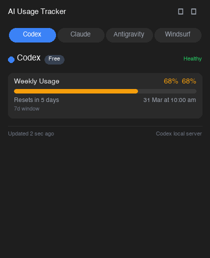
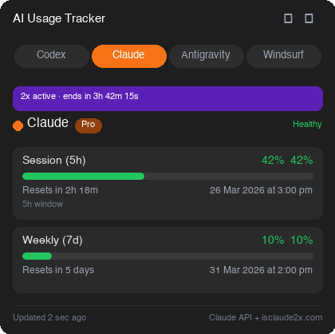
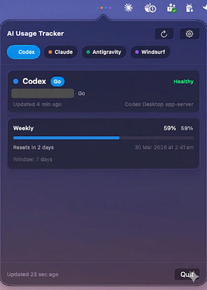
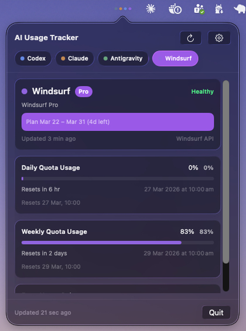
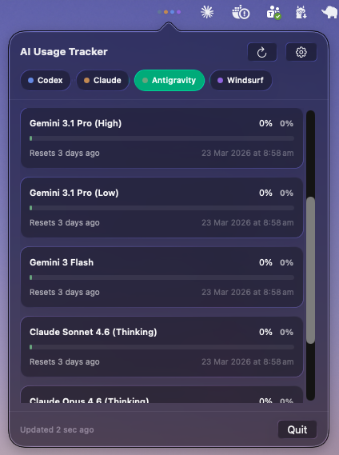

<div align="center">


# AI Usage Tracker

**A native macOS menu bar app that tracks real-time usage across your AI tools — all in one place.**

[](https://www.apple.com/macos/)
[](https://swift.org)
[](LICENSE)

<br/>



</div>

---

## Screenshots

<div align="center">




</div>

---

## Why

Switching between Claude, Codex, Windsurf, and Antigravity just to check how much quota you have left is tedious. AI Usage Tracker lives in your menu bar and shows everything at a glance — usage percentages, reset countdowns, and peak-hour status — without opening a single browser tab.

---

## Features

| Provider | What's tracked |
|---|---|
| **Claude** | Session (5h) % used + reset countdown · Weekly (7d) % used + reset date · 2× peak hour status via [isclaude2x.com](https://isclaude2x.com) |
| **Codex** | Weekly usage % + reset time |
| **Windsurf** | Daily quota % · Weekly quota % · Extra usage balance ($) |
| **Antigravity** | Per-model quotas (Gemini Pro, Flash, Claude, GPT-OSS) + refresh times |

**Additional highlights:**
- 🔔 **Threshold alerts** — macOS notifications when any quota hits 80% or 90%
- 🔐 **No password prompts** — credentials read once from Keychain, cached locally with `0600` permissions
- ♻️ **Smart caching** — respects API rate limits; manual refresh button forces a fresh fetch
- 🚀 **Opens at login** — runs silently as a menu bar item, no Dock icon
- 🎨 **Native macOS design** — built with SwiftUI, matches system appearance

---

## Requirements

- macOS 26 (Tahoe) or later
- Swift 6.0+
- Active accounts on the providers you want to track

---

## Installation

### 1. Clone and build

```bash
git clone https://github.com/AmrZakiiiii/AI-Usage-Tracker.git
cd "AI-Usage-Tracker"
swift build
```

### 2. Bundle and sign

```bash
# Copy binary into the app bundle
cp .build/debug/AIUsageTracker "dist/AI Usage Tracker.app/Contents/MacOS/AIUsageTracker"

# Ad-hoc sign (required for Keychain access)
codesign --force --deep --sign - "dist/AI Usage Tracker.app"
```

### 3. Launch

```bash
open "dist/AI Usage Tracker.app"
```

The app appears in your menu bar. On first launch it reads your Claude credentials from the macOS Keychain (the same entry used by Claude Code) — click **Allow** once and it will never ask again.

---

## Credential Setup

| Provider | How credentials are read |
|---|---|
| **Claude** | OAuth token from macOS Keychain (`Claude Code-credentials`), cached to `~/.claude/ai-usage-tracker-token-cache.json` |
| **Codex** | Local app server on `127.0.0.1:8765` — requires Codex to be running |
| **Windsurf** | API key read from Windsurf's local extension storage (`.vscdb`) |
| **Antigravity** | Quota data read from local Antigravity extension state |

No credentials are stored in this repository. All sensitive data remains on your machine.

---

## Architecture

```
Sources/
├── Adapters/          # Provider-specific data fetching
│   ├── ClaudeAdapter.swift        # Claude API + isclaude2x.com
│   ├── CodexAdapter.swift         # Codex local app server
│   ├── WindsurfAdapter.swift      # Codeium API + local state
│   └── AntigravityAdapter.swift   # Local extension state
├── Core/              # Shared models (UsageWindow, ProviderSnapshot)
├── Infrastructure/    # Keychain, file watching, SQLite, notifications
├── State/             # ProviderStore, SettingsStore
├── UI/                # SwiftUI views, popover layout
└── App/               # App entry point, menu bar controller
```

---

## Settings

Click the ⚙️ gear icon in the app to configure:

- **Refresh interval** — how often to poll (default: 30s)
- **Alert thresholds** — get notified at 80% and/or 90% usage
- **Enable/disable** individual providers

---

## Security

This project has been audited for secrets and is safe to fork publicly:

- ✅ No hardcoded API keys, tokens, or passwords in any source file
- ✅ `dist/`, `.build/`, `.claude/` are all excluded via `.gitignore`
- ✅ Token cache is written at runtime only, with `0600` permissions (owner read/write)
- ✅ All credentials are read from the local system at runtime — nothing is bundled

---

## Contributing

PRs welcome. To add a new provider, implement `ProviderAdapter` in `Sources/Adapters/` and register it in `ProviderStore`.

---

## License

MIT © [Amr Zaky](https://github.com/AmrZakiiiii)
